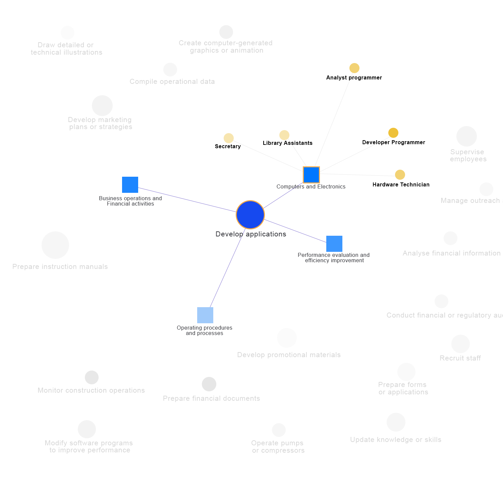

# General Data Processing - Outliers - VAIT Brisbane Team

The project Outliers belongs to the VAIT Brisbane Team for the Australia GovHack Competition 2021. The purpose of this is to analyse and design the mock-up data for the prototype.

Challenge: [Exploring the National Skills Commission’s Australian Skills Classification](https://hackerspace.govhack.org/challenges/exploring_the_national_skills_commission_s_australian_skills_classification).

## Overview

## Built With

* [Jupyter Notebook](https://jupyter.org/)
* [Python](https://www.python.org/)
* [Adobe Photoshop](https://www.adobe.com)

## Authors

* Nhi Van Kieu (nhikieuvan@gmail.com)
* Rodo Nguyen (duy8anh1@gmail.com)
* Jaymin Do (jaymindo248@gmail.com)

## Licenses

 * MIT License
